# Home Automation with Google Home

## Add esp8266 to Arduino IDE
use this link to set up arduino IDE and test the esp8266 [link](https://randomnerdtutorials.com/how-to-install-esp8266-board-arduino-ide/)

## Connecting the circuit
- Connect the in pin of the relay to D1 on the esp8266 development board
- connect the vcc to 3.3v
- connect gnd to gnd
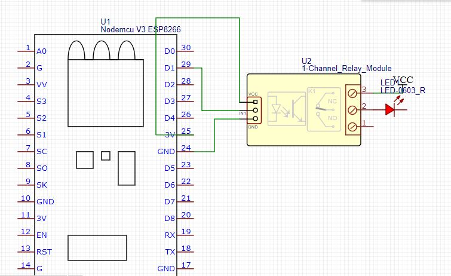
- use the normally closed connection

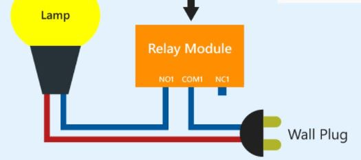

## Set up sinric pro
- Go to [sinric pro](https://sinric.pro/index.html) and sign up
- Click on devices and select add device
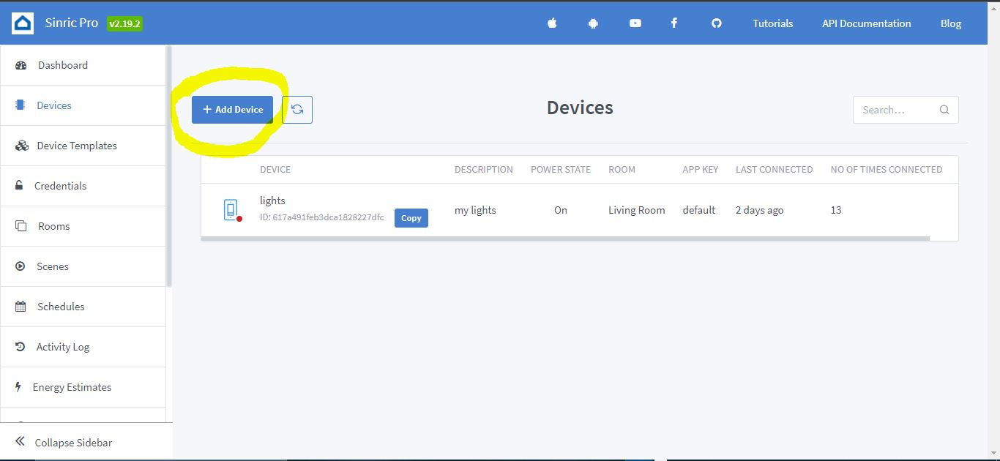
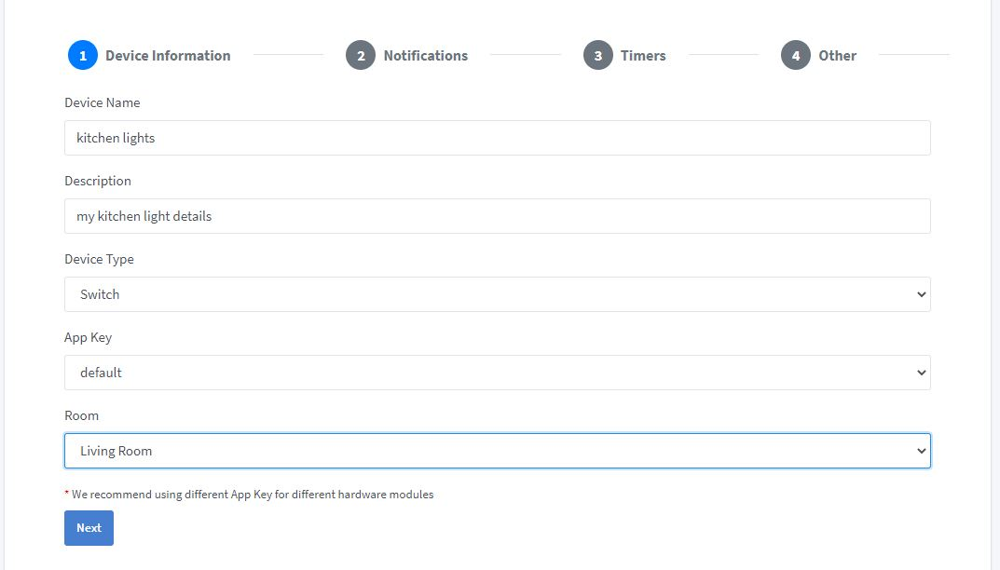
Leave the other options set to default for now or set them to your requirements
- Your device is now ready to connect
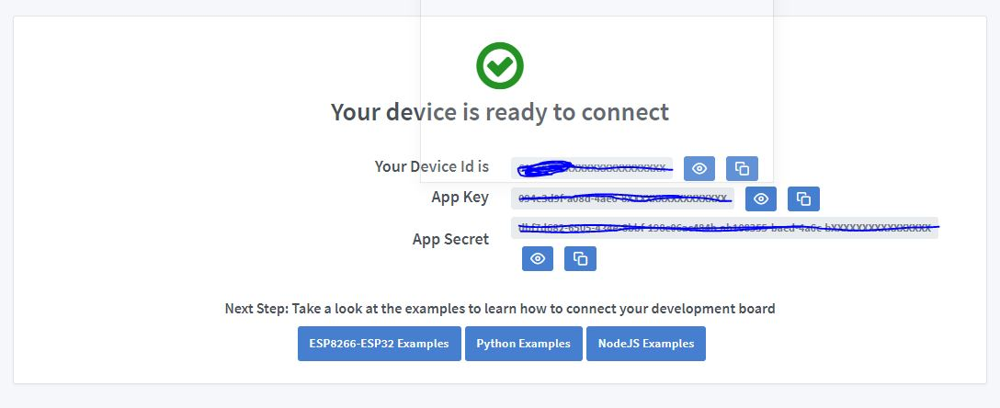
- Copy the generated credentials into the [arduino file](smart_light/smart_light.ino)
- also add your wifi SSID and password to the arduino file

## Connect with Google Home
- Install Google Home from [Google Play Store](https://play.google.com/store/apps/details?id=com.google.android.apps.chromecast.app&hl=en&gl=US)
- Open Google Home app and Create a new Home

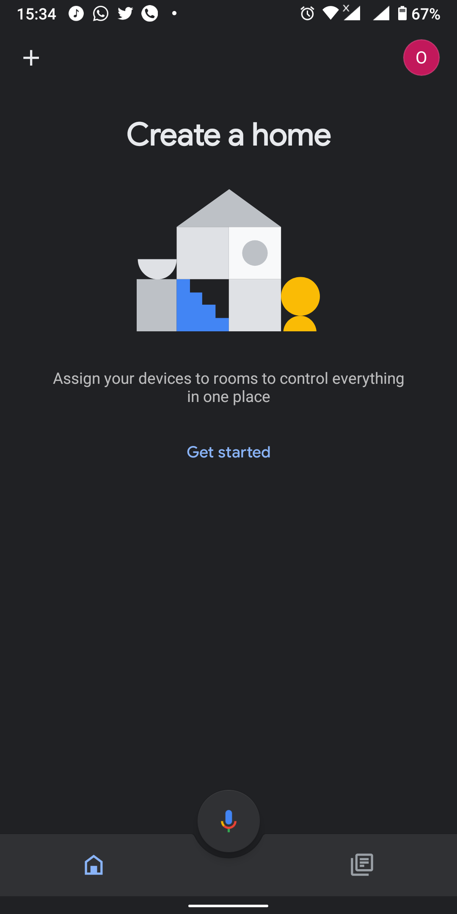
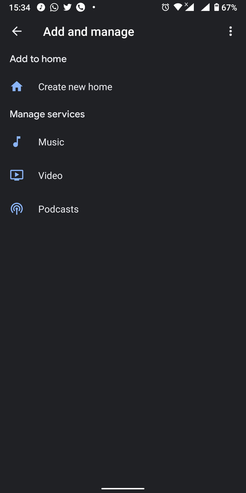
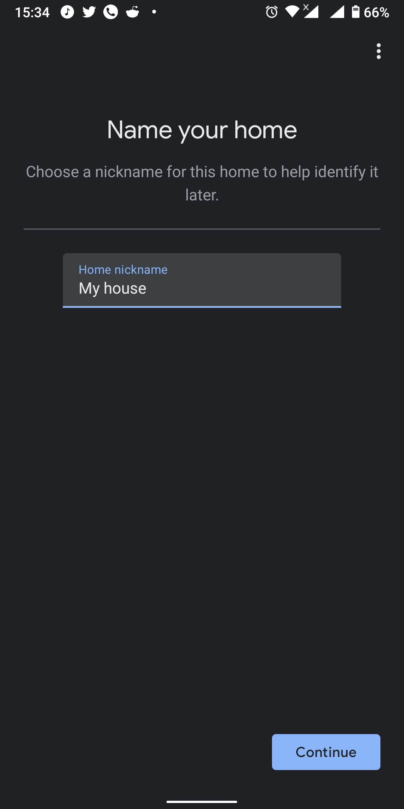
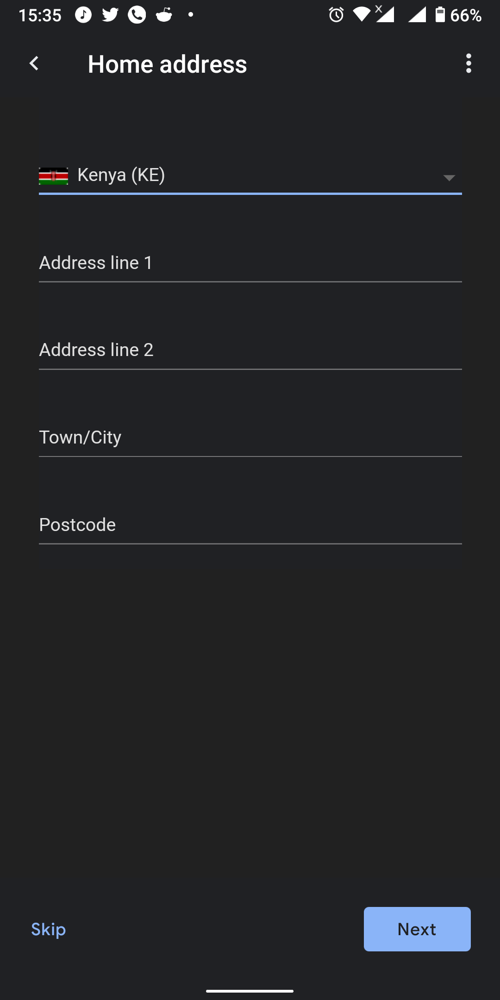
- Set up device
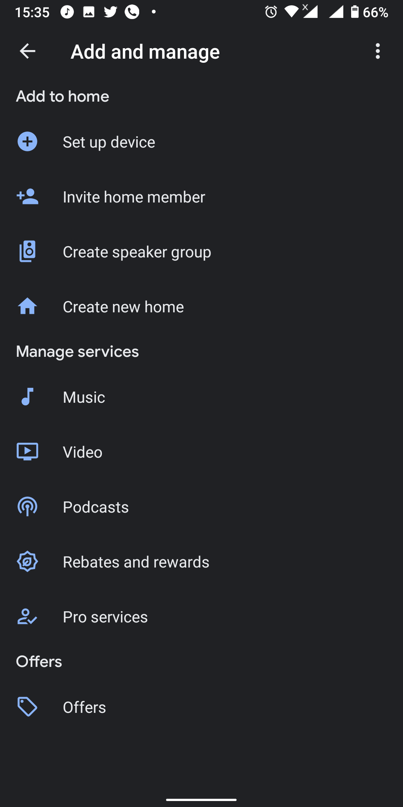
select works with google
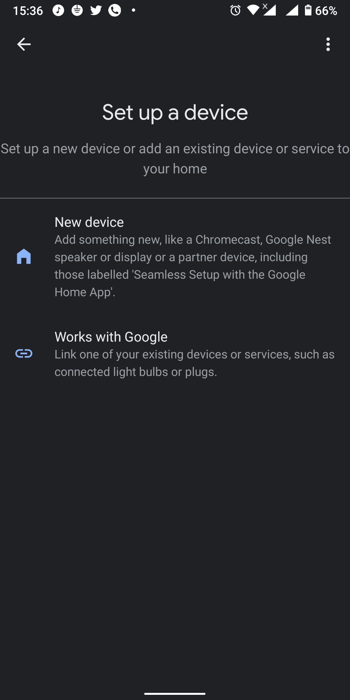
Search for sinric pro and select it
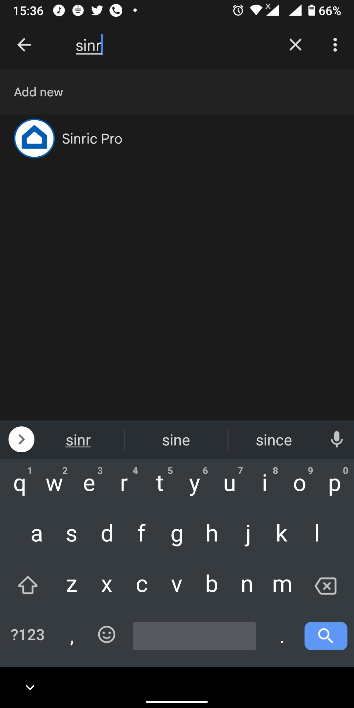
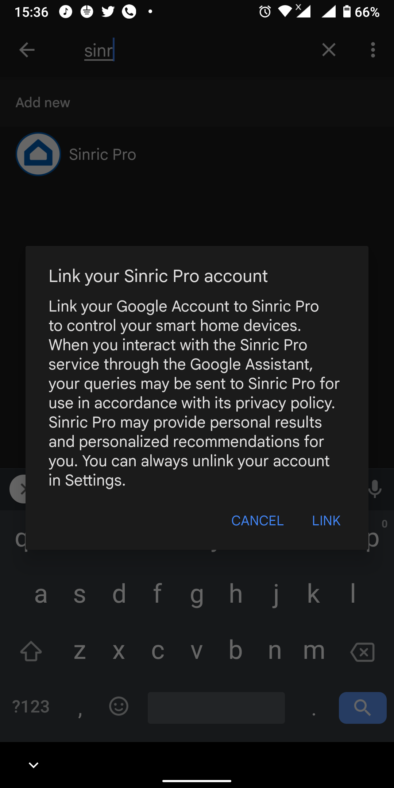
login to sinric pro using the account you had created
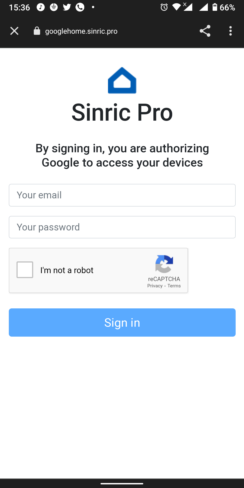
- Your device is now ready to connect
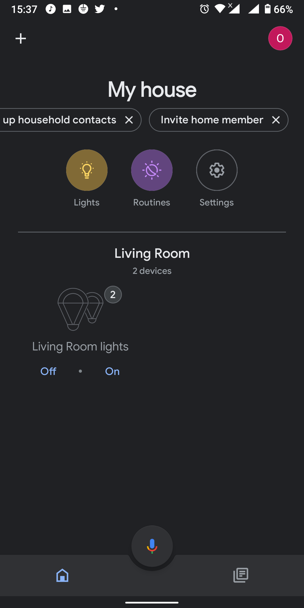
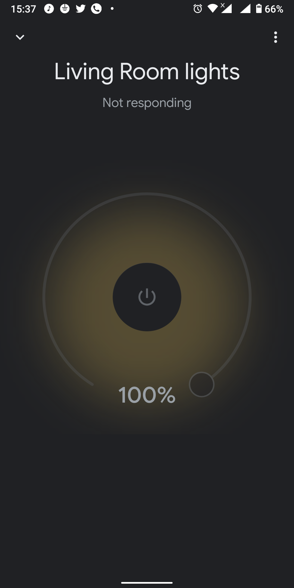
- you can use the buttons on the google home app to control your device as well as using google assistant to control the lights